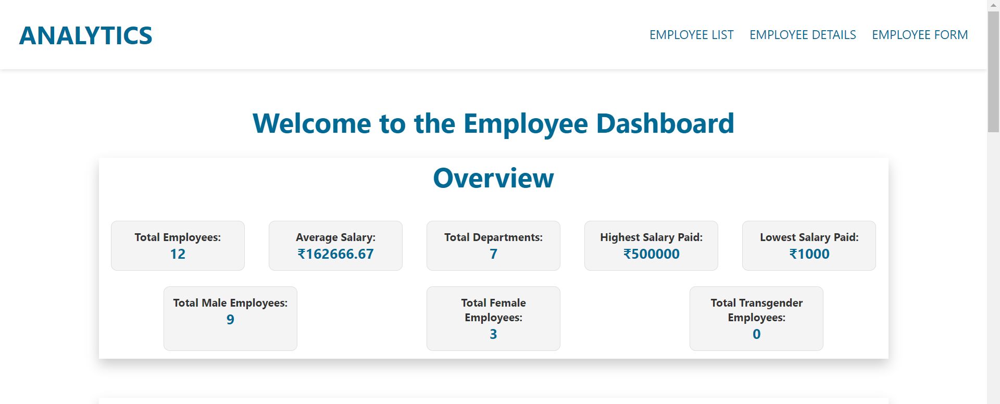
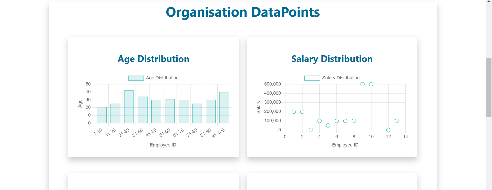
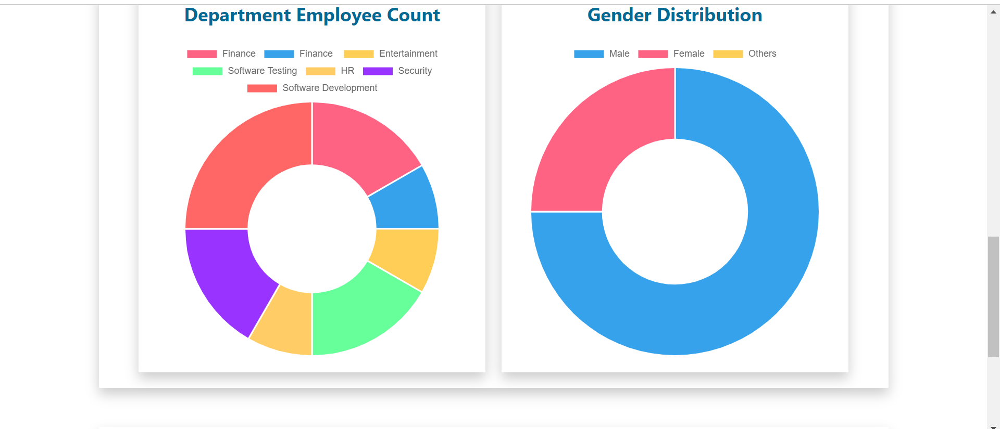
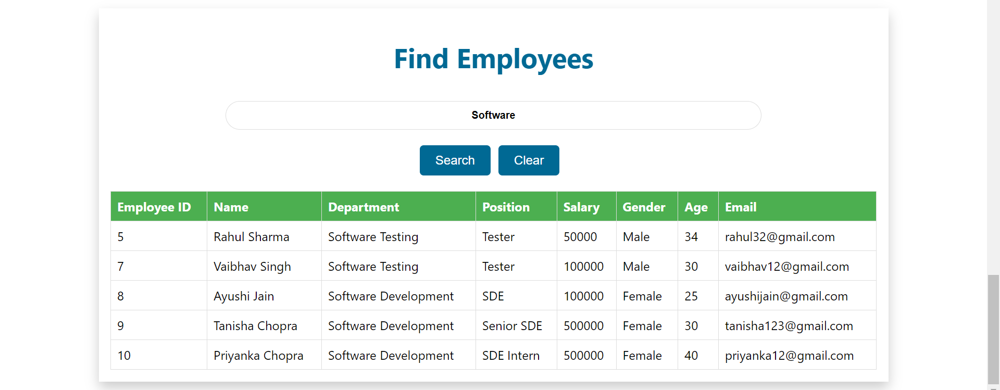
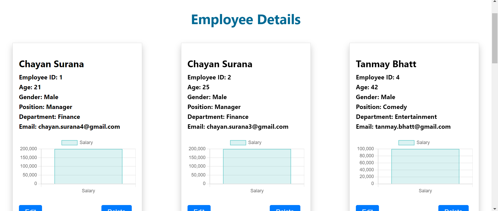
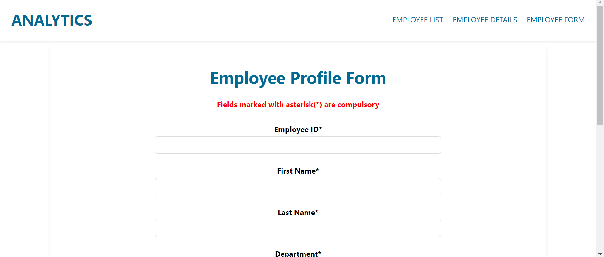

# 🚀 Employee Management System [Full Stack] 🚀

Welcome to the Employee Management System, a comprehensive web application built using ReactJS and NodeJS. This application empowers users to efficiently manage company employee data with a user-friendly interface, offering seamless CRUD functionality for employee records, data visualization through charts, and informative cards for individual employee data display.

## Table of Contents

- [🚀 Employee Management System \[Full Stack\] 🚀](#-employee-management-system-full-stack-)
  - [Table of Contents](#table-of-contents)
  - [Overview](#overview)
  - [Challenge Statement](#challenge-statement)
    - [Key Features](#key-features)
    - [Screenshots](#screenshots)
    - [Links](#links)
    - [Built With](#built-with)
  - [Local Deployment](#local-deployment)
  - [What I Learned](#what-i-learned)
  - [Author](#author)

## Overview

## Challenge Statement

Managing employee information is a critical aspect of organizational efficiency, and this project addresses the need for a robust Employee Management System. The challenge encompasses the development of a feature-rich web application that allows users to perform Create, Read, Update, and Delete (CRUD) operations on employee records. The system leverages the power of ReactJS for a dynamic and responsive frontend, while NodeJS handles the backend, ensuring a seamless end-to-end experience.

### Key Features

- **CRUD Functionality:** Users can easily add, view, edit, and delete employee records through intuitive interfaces.
- **Data Visualization:** The application incorporates charts for visualizing key employee data trends, providing insightful analytics.
- **User-Friendly Forms:** Interactive and easy-to-use forms streamline data entry and editing processes for a smooth user experience.
- **Informative Employee Cards:** Individual employee data is presented in visually appealing and informative cards for quick reference.
- **Dark-Light Mode Theme:** The website also has the option of dark or light mode as per the user preference.

Embark on this journey to create a powerful Employee Management System that not only simplifies administrative tasks but also enhances the overall efficiency of managing workforce information. Let's build a solution that transforms the way organizations handle employee data!

### Screenshots








### Links

- Solution URL: [GitHub Repository](https://github.com/chayansurana3/Employee-Analytics)
- Live Site URL: [Employee Analytics - Live Site](https://org-analytics.netlify.app)

### Built With

- React.js
- Node.js
- HTML5 markup
- CSS
- MongoDB
- Postman
- NPM

## Local Deployment

- Step 1
  - Create a MongoDB database and collect the database username and password.
- Step 2
  - Save the username and password in a .env file in the netlify/functions directory
  - ```
    MONGODB_USERNAME=""
    MONGODB_PASSWORD=""
    ```
- Step 3
  - Now, from the root project directory run ```netlify dev``` command. The project would start running in your local machine.

## What I Learned

Developing the Employee Management System has been an enriching experience, providing valuable insights and enhancing my skills in full-stack web development. Here are some key takeaways from this project:

- **Full-Stack Proficiency:** Through the integration of ReactJS for the frontend and NodeJS for the backend, I gained a holistic understanding of building robust, end-to-end web applications. This project has strengthened my abilities in both frontend and backend development.

- **CRUD Operations:** Implementing Create, Read, Update, and Delete functionalities for employee records not only honed my technical skills but also deepened my understanding of data management in a real-world context.

- **Data Visualization:** Incorporating charts for visualizing employee data trends has expanded my knowledge of data visualization libraries and techniques. I learned to present complex information in a visually appealing and easily understandable format.

- **User-Friendly Design:** Crafting intuitive and user-friendly forms has refined my skills in designing interfaces that enhance user experience. I now appreciate the importance of creating interfaces that are both functional and aesthetically pleasing.

- **Informative Data Display:** The creation of informative employee cards challenged me to present data in a concise yet comprehensive manner. This experience enriched my skills in designing visually appealing and content-rich components.

- **Database Management:** Working with a database, specifically MongoDB in this case, has deepened my understanding of database management, including schema design, querying, and optimization.

- **Problem Solving:** Overcoming challenges such as handling large datasets, ensuring data integrity, and optimizing application performance has significantly improved my problem-solving skills.

This project has not only added practical, real-world experience to my portfolio but has also provided a solid foundation for tackling more complex and challenging web development projects in the future. I look forward to applying these skills in my continuous journey of learning and growth.

## Author

- GitHub - [@chayansurana3](https://github.com/chayansurana3)
- Twitter - [@chayan_surana_](https://twitter.com/chayan_surana_)
